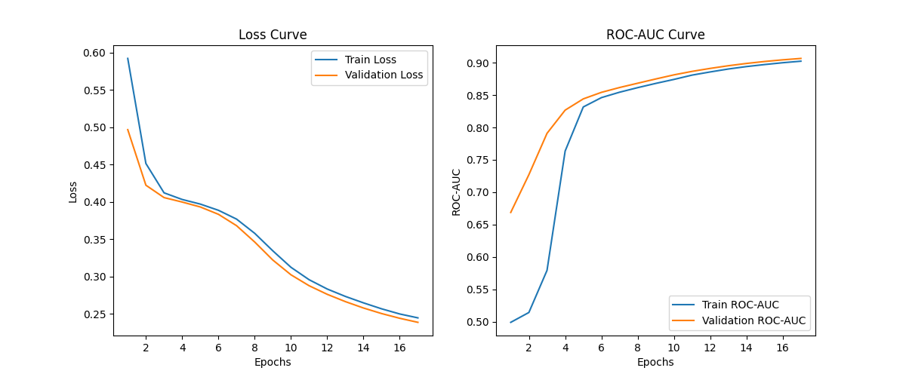

## Эксперимент 1

10 эпох:

15 эпох:

### Выводы по эксперименту 1:

На первых эпохах наблюдается значительное улучшение метрик (сильное снижение лосса и рост ROC-AUC), после 6-7 эпох темп улучшения значительно замедляется, но продолжается до 10-15 эпох.

В первой настройке (10 эпох) рост ROC-AUC и снижение лосса продолжаются до конца, при 15 эпохах также видно постепенное улучшение, но разница между 10-й и 15-й эпохами уже минимальна, при большем числе эпох возникает риск переобучения.

Оптимальное число эпох: около 10-12

## Эксперимент 2

### Выводы по эксперименту 2:

Модель стала лучше: увеличение hidden size и добавление блоков заметно улучшили качество: финальный ROC-AUC вырос с ~0.88 до 0.90 на валидации, лосс также снизился быстрее и продолжает снижаться после 10 эпох.

На первых эпохах обучение стало медленнее (Epoch 1 ROC-AUC ≈ 0.54 против 0.58 в предыдущем эксперименте), при этом после 5-6 эпох модель начинает быстрее набирать качество, улучшения продолжаются и после 10 эпох, а на 15-й эпохе ещё наблюдается рост ROC-AUC.

## Эксперимент 3

### Выводы по эксперименту 3:

Качество модели значительно улучшилось: уже на первой эпохе модель показывает Train ROC-AUC ≈ 0.87 и Val ROC-AUC ≈ 0.90, что значительно лучше по сравнению с предыдущими экспериментами. В итоге, к 15 эпохе достигается Val ROC-AUC ≈ 0.9195, что говорит о высоком качестве.
Благодаря skip connection и batch norm, модель быстро набирает хорошее качество уже в начале обучения. Улучшения по мере обучения становятся менее заметными, так как с первых эпох достигается высокий уровень.

## Эксперимент 4

p = 0.01

p = 0.1

p = 0.2

p = 0.5

p = 0.9

### Выводы по эксперименту 4: Влияние Dropout

1. dropout_p = 0.01

   Train Loss снижается с 0.2866 → 0.2141, Val Loss с 0.2398 → 0.2089, Val ROC-AUC достигает максимума 0.9203 на 14 эпохе, затем слегка снижается.

   При p = 0.01 наблюдается наивысший итоговый Val ROC-AUC среди всех экспериментов (0.9186), при этом есть небольшой разрыв между Train и Val Loss (0.2141 vs 0.2089), что говорит об умеренном переобучении.

2. dropout_p = 0.1

   Train Loss снижается с 0.3042 → 0.2303, Val Loss с 0.2478 → 0.2135, Val ROC-AUC плавно растет до 0.9172.
   Наиболее стабильное обучение: минимальные колебания Val Loss и ROC-AUC.
   Разрыв между Train и Val Loss меньше, чем у p=0.01, что указывает на баланс между обучением и регуляризацией.

3. dropout_p = 0.2

   Train Loss снижается с 0.3151 → 0.2380, Val Loss с 0.2533 → 0.2207, Val ROC-AUC достигает 0.9135.
   Медленное обучение: Val ROC-AUC растет слабее, чем при p=0.1.
   Больший разрыв между Train и Val Loss, чем у p=0.1 (0.2380 против 0.2207).

4. dropout_p = 0.5
   Train Loss снижается с 0.3439 → 0.2595, Val Loss с 0.3039 → 0.2328, Val ROC-AUC достигает 0.9070.
   При p = 0.5 видны признаки недообучения: низкие ROC-AUC и высокий Val Loss даже на поздних эпохах.

5. dropout_p = 0.9
   Train Loss снижается с 0.4136 → 0.3166, Val Loss с 0.4472 → 0.3908, Val ROC-AUC не превышает 0.8754.
   Сильное недообучение: крайне высокие потери и низкие ROC-AUC, Dropout "зашумляет" сеть, сильно усложняя обучение.

## Эксперимент 5

lr = 0.01, weight_decay = 0.1

lr = 0.01, weight_decay = 0.01

lr = 0.01, weight_decay = 0.001

lr = 0.1, weight_decay = 0.1

lr = 0.1, weight_decay = 0.01

lr = 0.1, weight_decay = 0.001

lr = 0.05, weight_decay = 0.1

lr = 0.05, weight_decay = 0.01

lr = 0.05, weight_decay = 0.001

1. lr = 0.01
   a) weight_decay = 0.1
   На первой эпохе показатели хорошие (Train ROC-AUC ≈ 0.887, Val ROC-AUC ≈ 0.907), но уже во второй эпохе наблюдается ухудшение – и ROC-AUC, и лоссы ухудшаются.
   Начиная с 3-й эпохи модель «застревает» – показатели постепенно падают и стабилизируются на уровне Train ROC-AUC ≈ 0.85–0.86 и Val ROC-AUC ≈ 0.85–0.86.
   Вывод: Слишком сильная регуляризация (λ=0.1) при низком lr приводит к недообучению.

   b) weight_decay = 0.01
   На первой эпохе показатели хорошие – Train ROC-AUC ≈ 0.888, Val ROC-AUC ≈ 0.910. Модель стабильно улучшается, достигая в промежуточных эпохах ROC-AUC ≈ 0.91–0.92.
   Итоговые показатели на 15 эпохе – Train ROC-AUC ≈ 0.914, Val ROC-AUC ≈ 0.919, хотя последний шаг немного «откатился» (Val ROC-AUC ≈ 0.9188).
   Вывод: Умеренная регулярзация (λ=0.01) при lr=0.01 позволяет модели обучаться хорошо, но итоговые метрики немного уступают лучшим.

   c) weight_decay = 0.001
   Показатели на старте схожи с предыдущими вариантами – старт около 0.888/0.909.
   Модель демонстрирует устойчивый рост ROC-AUC, доходя до Epoch 12–14 до Train ROC-AUC ≈ 0.919 и Val ROC-AUC ≈ 0.925. Итоговые метрики наилучшие: финальные значения – Train ROC-AUC ≈ 0.921, Val ROC-AUC ≈ 0.925, а лоссы ниже.

   Вывод: При lr=0.01 уменьшение weight decay до 0.001 даёт наилучший баланс между регуляризацией и способностью модели подстраиваться под данные.

2. lr = 0.05
   a) weight_decay = 0.1
   Уже с первой эпохи показатели хуже – Train ROC-AUC ≈ 0.860, Val ROC-AUC ≈ 0.855.
   Модель стабильно показывает низкие значения ROC-AUC (около 0.846–0.85) и не улучшается к концу – итоговые метрики около 0.849–0.848.
   Вывод: При достаточно высоком weight decay и lr=0.05 модель недообучается.

   b) weight_decay = 0.01
   Начальные значения неплохие – Train ROC-AUC около 0.895, Val ROC-AUC около 0.908, но уже во второй и третьей эпохах наблюдаются скачки
   Итоговые результаты не показывают улучшения модели – к концу ROC-AUC снижается до ~0.89 (Train) и ~0.902 (Val).
   Вывод: При lr=0.05 увеличение весового распада до 0.01 приводит к нестабильности и, в итоге, снижению качества.

   c) weight_decay = 0.001
   Начальные метрики схожи с предыдущими вариантами (Train ROC-AUC ≈ 0.892, Val ROC-AUC ≈ 0.910).
   Модель постепенно улучшает показатели до Epoch 3–5 (ROC-AUC достигает ≈ 0.907–0.912), но наблюдаются значительные скачки в значениях лосса (например, во 4-й и 6-й эпохах – Val Loss резко возрастает).
   Вывод: Хотя итоговые метрики (финальные Train ROC-AUC ≈ 0.9207, Val ROC-AUC ≈ 0.9234) сопоставимы с lr=0.01/λ=0.001, обучение происходит с заметной нестабильностью и скачками в потерях.

3. lr = 0.1
   a) weight_decay = 0.1
   Плохие стартовые показатели – Train ROC-AUC ≈ 0.848, Val ROC-AUC ≈ 0.868.
   Модель практически не улучшается, итоговые значения остаются низкими (Train ROC-AUC ≈ 0.846, Val ROC-AUC ≈ 0.866).
   Вывод: Слишком высокая скорость обучения в сочетании с агрессивной регуляризацией приводит к сильному недообучению.

   b) weight_decay = 0.01
   Начальные метрики хорошие (Train ROC-AUC ≈ 0.890, Val ROC-AUC ≈ 0.886), но затем наблюдаются скачки.
   Итоговые показатели остаются умеренными – примерно Train ROC-AUC ≈ 0.889 и Val ROC-AUC ≈ 0.902.
   Вывод: При lr=0.1 регуляризация с λ=0.01 не способна компенсировать слишком высокую скорость обучения, итоговое качество ниже, чем при более низком lr.

   c) weight_decay = 0.001
   Показатели стартуют на уровне Train ROC-AUC ≈ 0.887, Val ROC-AUC ≈ 0.910.
   Модель показывает неоднородное поведение: в некоторых эпохах наблюдаются резкие скачки (например, резкое увеличение Val Loss до 1.3824 или 0.3657), однако к концу обучения показатели стабилизируются – финальные значения Train ROC-AUC ≈ 0.9156, Val ROC-AUC ≈ 0.9244.

   Вывод: Несмотря на нестабильность в процессе (что указывает на слишком высокую скорость обучения для данного случая), итоговые метрики могут быть конкурентоспособны, однако процесс обучения менее устойчив по сравнению с lr=0.01.

Выводы:
Learning Rate:

Низкий lr (0.01) обеспечивает стабильное и плавное улучшение метрик, позволяя модели достигнуть высоких значений ROC-AUC без скачков.

Увеличение lr может привести к ускоренному обучению, но часто сопровождается нестабильностью и даже ухудшением итоговых показателей, особенно в сочетании с агрессивным weight decay.

Weight Decay:

Слишком высокое значение (0.1) ведёт к сильной регуляризации, вызывая недообучение
Умеренные значения (0.01) дают стабильные результаты, но лучшие показатели получаются при минимальном weight decay (0.001) – особенно при lr=0.01, где достигаются самые высокие метрики (Val ROC-AUC около 0.925).
Однако при высоком lr (0.1) даже низкий weight decay может вызвать нестабильность в обучении.

Таким образом, итоговое качество модели и динамика обучения чувствительны как к lr, так и к weight decay: увеличение этих параметров либо приводит к переусложнению регуляризации и недообучению, либо к нестабильности при слишком высоком lr.

Итог: оптимальное сочетание параметров: lr = 0.01 и weight_decay = 0.001
